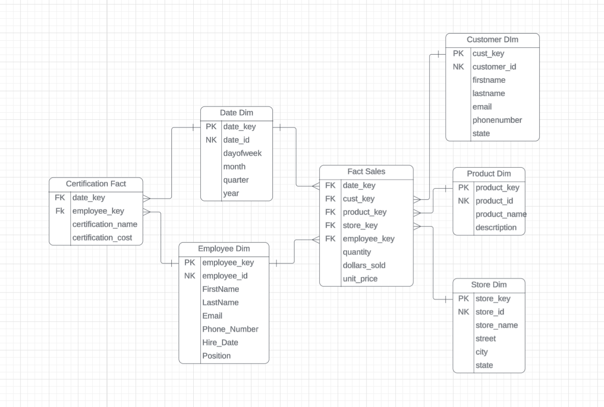

# dbt Exercise Instructions #
- Let's add data from another source into our Oliver data warehouse that we built in the preivous module. The goal here is to learn how to combine
multiple sources into our datawarehouse and build some conformed dimensions.



### Extract and Load (FiveTran) ###
- Sign into fivetran
- Click on 'Connections'
    - Click 'Add Connection'
- Search for and select 'Amazon S3'
- Select the destination you previously set up for Snowflake
- Set the Destination schema to `oliver_dw_source`
- Set the table group name to `employee_certifications`
- Set the Bucket to `employee-certifications`
- Set the access approach to `Access Key and Secret`
- Set the Access Key ID to the value provided in canvas
- Set the Access Key Secret to the value provided in canvas
- Click `+ Add files` under Configure files
- Set the table name to `employee_certifications`
- Click Save
- Under format, set File Type to csv
- Click Save & Test
- Click 'Sync Now' in the top right corner
- Wait for the sync to finish, login to Snowflake, check to see if you have a new schema in your database called `oliver_dw_source`
    - Confirm that the tables created and that they have data
- Go back to fivetran, click on connectors on the left hand side, click your connector that you just set up
    - Make sure the toggle on the top right is set to paused. If it's set to enabled, then click it and change it to paused.

### Transform (dbt) ###
- Login to GitHub
- Go to your repository you created when you set up dbt cloud
- Click Branches
    - New Branch
    - Call the new branch 'Core5'
    - Click Create New Branch

- Login to dbt Cloud
- Click Studio
- Click 'Change Branch'
    - Select the new branch we just created called 'Exericse_dbt_part2'

- Open the model directory, open the oliver directory
- Open up `_src_oliver.yml`
    - Add the new source to the file
```

```

### This new table contains all of certifications that employees have received.

#### stg_employee_certifications
- Build a staging model for the new employee certification data.
- Create a new file in your oliver directory called `stg_customer_service_interactions.sql`

##### TIPS
- There is a json field in the source table called `certification_json`
- There are 3 fields contained in this json field: `certification_name`, `certification_cost`, `certification_awarded_date`
- You need to parse these json fields out and add them as new fields in the stg table.
- Here is a tip for the syntax needed:
    - `PARSE_JSON([json field name]):[nested field name]::[data type you want to set it as] AS [field alias]`

```

```


#### fact_certification ####
- Create a new file inside of the oliver directory called `fact_certification.sql`
- This fact will contain keys from the following dimensions:
    - dim_date
    - dim_employee
This fact will contain the following metrics:
    - certification_name
    - certification_cost

```


```

#### Model Attributes YAML file ####
- Update your model attributes file: `_schema_oliver.yml` with the new models we've created
- Add a description for the new stg model and the new fact
    - Explain the grain of the fact in your description
```

```

## Create a Pull Request on GitHub for the changes you have made ##
- Click Save on any files that you have made changes in.
- Click `Commit and Sync`
- Type a commit message explaining the changes you've made. Click `Commit Changes`.
- Click `Create a pull request on GitHub`
    - You will be redirected to GitHub
- Review your changes and click `Create pull request`
- Type a description about the changes you are proposing to the project.
- Click `Create Pull Request`
- merge your branch into the main branch by clicking `Merge pull request`.

## Submit a screenshot of the code for you new fact_certification model in dbt
## Submit a second screenshot showing a select * from fact_certification in Snowflake