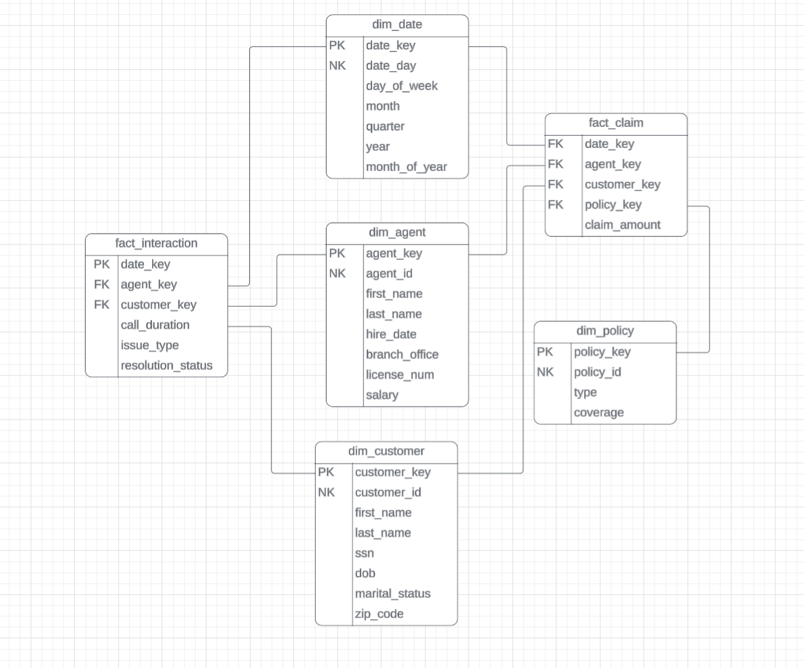

# dbt Exercise Instructions #
- Let's add data from another source into our Insurance data warehouse that we built in the preivous module. The goal here is to learn how to combine
multiple sources into our datawarehouse and build some conformed dimensions.



- Now, we are going to use a semi-normalized transactional database given to us by Sarah's insurance company. Let's work through an ELT process for Sarah's insurance company using Airbyte and dbt. 
### Extract and Load (FiveTran) ###
- Sign into fivetran
- Click on 'Connections'
    - Click 'Add Connection'
- Search for and select 'Amazon S3'
- Select the destination you previously set up for Snowflake
- Set the Destination schema to `insurance_dw_source`
- Set the table group name to `customer_service_interactions`
- Set the Bucket to `customer-service-interactions`
- Set the access approach to `Access Key and Secret`
- Set the Access Key ID to the value provided in canvas
- Set the Access Key Secret to the value provided in canvas
- Click `+ Add files` under Configure files
- Set the table name to `customer_service_interactions`
- Click Save
- Under format, set File Type to csv
- Click Save & Test
- Click 'Sync Now' in the top right corner
- Wait for the sync to finish, login to Snowflake, check to see if you have a new schema in your database called `insurance_dw_source`
    - Confirm that the tables created and that they have data
- Go back to fivetran, click on connectors on the left hand side, click your connector that you just set up
    - Make sure the toggle on the top right is set to paused. If it's set to enabled, then click it and change it to paused.

### Transform (dbt) ###
- Login to GitHub
- Go to your repository you created when you set up dbt cloud
- Click Branches
    - New Branch
    - Call the new branch 'Exercise_dbt_part2'
    - Click Create New Branch

- Login to dbt Cloud
- Click Studio
- Click 'Change Branch'
    - Select the new branch we just created called 'Exericse_dbt_part2'

- Open the model directory, open the insurance directory
- Open up `_src_insurance.yml`
    - We will need to add our new source to this yaml file.
- Below is the updated code that we will use in this file:
```
version: 2

sources:
  - name: insurance_landing
    database: firstnamelastname
    schema: insurance_dw_source
    tables:
      - name: agents
      - name: claims
      - name: customers
      - name: policies
      - name: customer_service_interactions
```

### This new table contains interactions between agents and customers. All of the agents in this file already exist in dim_agent, but there are additional
### customers that do not yet exist in dim_customer. We will need to add these customers to the customer dimenension

We have been told by the business and those who maintain the source systems we are consuming from that we can match customers up based on their full name. There will not be multiple customers with the same exact full name. We will need to add these customer to the customers dimensions and de-duplicate them based on their full name.

#### stg_customer_service_interactions
- We are going to build a stg model for the new customer_service_interactions data. dbt recommends doing this for all of your sources.
We are going to add it for this one specifically because we need to do some data parsing that we don't want to do multiple times if we use this data
in multiple models downstream.

```
{{ config(
    materialized = 'table',
    schema = 'dw_insurance'
)}}

select
    interaction_id, 
    split_part(customer_name, ' ', 1) as customer_first_name,
    split_part(customer_name, ' ', 2) as customer_last_name,
    customer_email, 
    split_part(agent_name, ' ', 1) as agent_first_name,
    split_part(agent_name, ' ', 2) as agent_last_name,
    agent_email, 
    interaction_date, 
    channel, 
    issue_type, 
    resolution_status, 
    call_duration_min
from {{ source('insurance_landing', 'customer_service_interactions')}}
```

#### dim_customer (updated)
- Open up your `dim_customer.sql` file. 
- Make the following changes to include customers from both data sources we are consuming from.
- We are going to use cte's to bring both of our sources in.
- We will need to use a different form of surrogate key since the data from both sources will not have the customerid.

```
{{ config(
    materialized = 'table',
    schema = 'dw_insurance'
)}}

with db_source as (
    select
        customerid,
        firstname,
        lastname,
        dob,
        address,
        city,
        state,
        zipcode
    from {{ source('insurance_landing', 'customers') }}
)

, cs_interactions_source as (
    select
        customer_first_name,
        customer_last_name,
        customer_email,
    from {{ ref('stg_customer_service_interactions)}}
)

, final as (
    select
        db.customerid,
        coalesce(db.firstname, cs.customer_first_name) as firstname,
        coalesce(db.lastname, cs.customer_last_name) as lastname,
        db.dob,
        db.address,
        db.city,
        db.state,
        db.zipcode,
        cs.customer_email
    from db_source db
    full join cs_interactions_source cs
        on db.firstname = cs.customer_first_name
        and db.lastname = cs.customer_first_name
)

select
    {{ dbt_utils.generate_surrogate_key(['firstname', 'lastname']) }} as customer_key,
    *
from final

```


#### fact_interaction ####
- Create a new file inside of the insurance directory called `fact_interaction.sql`
- Here is the code for fact_interaction:
```
{{ config(
    materialized = 'table',
    schema = 'dw_insurance'
) }}

SELECT
    cu.customer_key,
    a.agent_key,
    d.date_key,
    c.call_duration,
    c.issue_type,
    c.resolution_status
FROM {{ ref('stg_customer_service_interactions') }} c
INNER JOIN {{ ref('dim_customer') }} cu 
    ON c.customer_first_name = cu.firstname
    and c.customer_last_name = cu.lastname
INNER JOIN {{ ref('dim_agent') }} a 
    ON c.agent_first_name = a.firstname
    and c.agent_last_name = a.lastname
INNER JOIN {{ ref('dim_date') }} d 
    ON d.date_day = c.interaction_date

```

- Save the file, after you have done that, you can go to your terminal and type `dbt run -m fact_interaction` to build the model.
    - Go to Snowflake to see the newly created table!

- If for some reason you need to run all files then you can run: `dbt run -m insurance`.

#### Model Attributes YAML file ####
- Update your model attributes file: `_schema_insurance.yml` with the new models we've created
- Below is the new version of the file that contains the new models:
```
version: 2

models:
  - name: dim_agent
    description: "Insurance Agent Dimension"
  - name: dim_customer
    description: "Insurance Customer Dimension"
  - name: dim_date
    description: "Insurance Date Dimension"
  - name: dim_policy
    description: "Insurance Policy Dimension"
  - name: fact_claim
    description: "Insurance Claim Fact"
  - name: stg_customer_service_interactions
    description: "Staging model for customer service interactions"
  - name: fact_interaction
    description: "Customer Service Interaction Fact"
```

## Create a Pull Request on GitHub for the changes you have made ##
- Click Save on any files that you have made changes in.
- Click `Commit and Sync`
- Type a commit message explaining the changes you've made. Click `Commit Changes`.
- Click `Create a pull request on GitHub`
    - You will be redirected to GitHub
- Review your changes and click `Create pull request`
- Type a description about the changes you are proposing to the project.
- Click `Create Pull Request`
- merge your branch into the main branch by clicking `Merge pull request`.